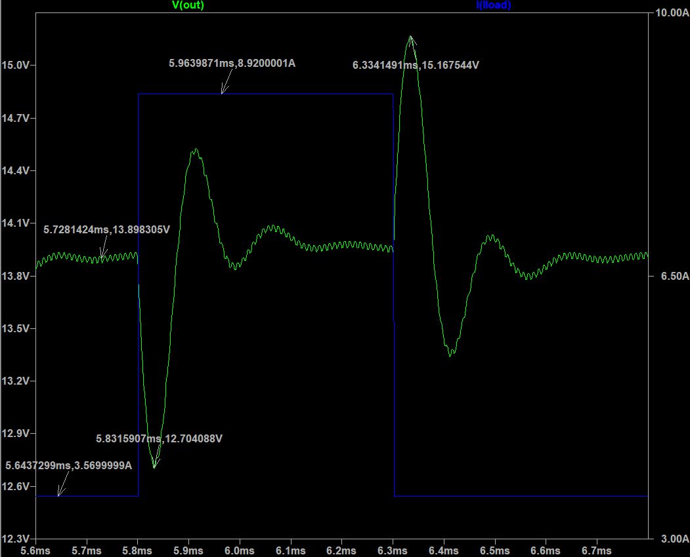

# DC-DC Synchronous Buck Converter Design

## Önce Buradan Başlayın

[Tam Tez Raporu: Detaylı Tasarım, Hesaplar, Şekiller ve LTspice Doğrulamaları](docs/full-report.md)

Bu repository'nin ana okuma yüzeyi `docs/full-report.md` dosyasıdır. README yalnızca hızlı yönlendirme ve kısa proje bağlamı sağlar; güç katı hesapları, kontrolcü tasarımı, denklemler, Bode diyagramları, op-amp gerçekleme adımları, benzetim ekran görüntüleri, kaynaklar ve ekler tam raporda tutulur.

## Hızlı Gezinme

| Başlık | Bağlantı |
|---|---|
| Tam rapor | [docs/full-report.md](docs/full-report.md) |
| Simülasyon klasörü | [LTspice_AveragedSwitchModelingSimulation/](LTspice_AveragedSwitchModelingSimulation/) |
| MIT 6.622 şartnamesi | [G5_mit6_622_s23_designproj.pdf](G5_mit6_622_s23_designproj.pdf) |
| Veri sayfası / ekler | [docs/full-report.md#ekler](docs/full-report.md#ekler) |
| Doğrulama özeti | [docs/verification-summary.md](docs/verification-summary.md) |
| Görsel ve kaynak haritası | [docs/source-map.md](docs/source-map.md) |
| Kaynak DOCX | [Birinci_donem_Buck_Converter_Serbest_Projesi.docx](Birinci_donem_Buck_Converter_Serbest_Projesi.docx) |

## Bu Repoda Ne Var?

Bu çalışma, MIT 6.622 tasarım projesi gereksinimlerinden yola çıkarak hazırlanmış bir **senkron buck converter** tasarım, analiz ve benzetim reposudur. Proje; güç katı seçimi, frekans yerleşimi, küçük işaret modeli, PID/Type-3 kompanzasyon, op-amp ile gerçekleme ve LTspice doğrulamalarını tek teknik akışta toplar.

Tasarım hedefi, $24-36\,\text{V}$ giriş aralığından $14\,\text{V}$ regüle çıkış üreten ve yaklaşık $50-125\,\text{W}$ güç aralığında çalışan bir senkron alçaltıcı dönüştürücü kurmaktır. Güç katı parametreleri kontrol tasarımından ayrı düşünülmez; $L$, $C$, ESR, anahtarlama frekansı, crossover hedefi ve kompanzasyon eğrisi birlikte ele alınır.

## Temel Tasarım Spesifikasyonları

| Gereksinim | Hedef |
|---|---:|
| Giriş gerilimi | $24-36\,\text{V}$ |
| Giriş transient limiti | $44\,\text{V}$, en çok $1\,\text{ms}$ |
| Çıkış gücü | $50-125\,\text{W}$ |
| Statik çıkış gerilimi | $14\,\text{V}\pm3\%$ |
| Transient çıkış gerilimi | $14\,\text{V}\pm20\%$ |
| İzin verilen çıkış ripple | $100\,\text{mV}_{p-p}$ |
| İzin verilen giriş akımı ripple | $50\,\text{mA}_{p-p}$ |
| Minimum verim | $90\%$ |
| Ortam sıcaklığı | $-20^\circ\text{C}$ to $+50^\circ\text{C}$ |

## Öne Çıkan Teknik Sonuçlar

| Alan | Seçim / Sonuç |
|---|---|
| Anahtarlama frekansı | $f_s=100\,\text{kHz}$ |
| Crossover hedefi | Yaklaşık $10\,\text{kHz}$ |
| Phase margin | Yaklaşık $53-55^\circ$ |
| Referans gerilimi | $V_{ref}=1.8\,\text{V}$ |
| PWM ramp genliği | $V_m=4\,\text{V}$ |
| Sensör kazancı | $H\approx0.12857$ |
| Bobin | Yaklaşık $49.42\,\mu\text{H}$ |
| Çıkış sığacı | $82\,\mu\text{F}$ |
| Sığaç ESR | $19.39\,\text{m}\Omega$ |
| Sensor divider | $R_3=12.8\,\text{k}\Omega$, $R_5=87.2\,\text{k}\Omega$ |
| Compensator elemanları | $R_2=100\,\text{k}\Omega$, $R_1=21\,\text{k}\Omega$, $R_4=2.4\,\text{k}\Omega$, $C_2=1.59\,\text{nF}$, $C_4=2.2\,\text{nF}$ |

## Verification Özeti

| Kontrol | Raporlanan sonuç | Durum |
|---|---:|---|
| Çıkış gücü | Yaklaşık $49.5957-124.1839\,\text{W}$ | Geçti |
| Statik çıkış hatası | Yaklaşık $1.30\%$ | Geçti |
| Transient sapma | Yaklaşık $\pm8.58\%$ | Geçti |
| Çıkış ripple | Yaklaşık $37.38\,\text{mV}_{p-p}$ | Geçti |
| Verim | Yaklaşık $97.78\%$ | Geçti |
| Giriş transient, giriş ripple, sıcaklık sweep | Hedef olarak listelendi; ayrı görsel doğrulama yok | Takip gerekiyor |

Ayrıntılı değerlendirme ve kanıt bağlantıları için [docs/verification-summary.md](docs/verification-summary.md) dosyasına bakın.

## Görsel Kanıtlar

**Sistem block diagramı**

**Nihai açık çevrim Bode diyagramı**

**Transient çıkış davranışı**

**Çıkış ripple ölçümü**

## Repository Yapısı

| Path | İçerik |
|---|---|
| [docs/full-report.md](docs/full-report.md) | Ana teknik rapor |
| [docs/index.md](docs/index.md) | Dokümantasyon giriş sayfası |
| [docs/assets/full-report/](docs/assets/full-report/) | Tam raporda kullanılan semantik görsel assetleri |
| [docs/originals/](docs/originals/) | Kaynak DOCX/PDF kopyaları |
| [LTspice_AveragedSwitchModelingSimulation/](LTspice_AveragedSwitchModelingSimulation/) | LTspice devreleri, modelleri ve sonuç dosyaları |
| [images/readme/](images/readme/) | Eski/yardımcı README görselleri |
| [tools/](tools/) | Dönüşüm, asset çıkarımı ve QA scriptleri |

## Simülasyon Dosyaları

Buck converter çalışması için başlıca LTspice dosyaları:

| Dosya | Rol |
|---|---|
| [SyncBuck_switching_CL.asc](LTspice_AveragedSwitchModelingSimulation/SyncBuck_switching_CL.asc) | Kapalı çevrim anahtarlamalı senkron buck devresi |
| [SyncBuck_average_CL.asc](LTspice_AveragedSwitchModelingSimulation/SyncBuck_average_CL.asc) | Ortalama model kapalı çevrim doğrulaması |
| [SyncBuck_average_fresponses.asc](LTspice_AveragedSwitchModelingSimulation/SyncBuck_average_fresponses.asc) | Frekans cevabı / loop-gain çalışmaları |
| [SyncBuck_average_parameters.asc](LTspice_AveragedSwitchModelingSimulation/SyncBuck_average_parameters.asc) | Parametre tabanlı ortalama model |
| [PID_compensator.asc](LTspice_AveragedSwitchModelingSimulation/PID_compensator.asc) | PID/Type-3 compensator denemeleri |

Not: `LTspice_AveragedSwitchModelingSimulation/SyncBuck_switching_CL.raw` yaklaşık 523 MB olduğu için GitHub commit'ine alınmadı. Dosya yerelde korunur; gerekirse harici bulut depolama veya GitHub Release asset olarak ayrıca paylaşılmalıdır.

## Source of Truth

Çelişki durumunda öncelik sırası:

1. [Birinci_donem_Buck_Converter_Serbest_Projesi.docx](Birinci_donem_Buck_Converter_Serbest_Projesi.docx)
2. Yereldeki görseller, simülasyon ekran görüntüleri ve LTspice dosyaları
3. Mevcut README ve yardımcı dokümantasyon

README bir giriş kapısıdır; teknik kararlar için [docs/full-report.md](docs/full-report.md) ve kaynak DOCX esas alınmalıdır.
