
# DC-DC Synchronous Alçaltıcı Dönüştürücü Tasarımı, Analizi ve Benzetimi

## Kapak ve Onay Bilgisi

**2025**

**Lisans Tezi**

**Elektrik-Elektronik Mühendisliği**

**Gökberk Güçin**

Ad SOYAD tarafından hazırlanan "TEZİN ADI" başlıklı bu tezin Lisans Tezi olarak uygun olduğunu onaylarım.

**Tarih:** xx/xx/201x

**Tez danışmanı:** Doç. Dr. Ozan GÜLBUDAK  
Karabük Üniversitesi Elektrik-Elektronik Mühendisliği Bölümü

**Jüri üyesi:** Ünvan. Ad SOYAD  
xxxx Üniversitesi xxx Mühendisliği Bölümü

**Jüri üyesi:** Ünvan. Ad SOYAD  
Karabük Üniversitesi xxxx Bölümü

# Abstract

**B. Sc. Thesis**

**DESIGN, ANALYSIS AND SIMULATION OF DC-DC SYNCHRONOUS BUCK CONVERTER**

**Gökberk Güçin 2017010215016**

**Karabük University**  
**Faculty of Engineering Department of Electrical-Electronics Engineering**

**Thesis Advisor:** Doç. Dr. Ozan GÜLBUDAK

**January 2025, 60 pages**

This undergraduate thesis focuses on the design and analysis of a synchronous DC-DC buck converter, which is widely used in power electronics for efficient voltage regulation. The study includes the systematic calculation and optimization of power stage components such as inductors, capacitors, and MOSFETs to achieve desired performance metrics. A comprehensive control strategy utilizing a PID compensator is developed to ensure stable and precise output voltage regulation under varying load and input conditions. Simulation results verify the design's efficiency, ripple control, and transient response, meeting the specified requirements. The findings demonstrate the feasibility of integrating theoretical principles with practical applications in the field of power electronics.

**Key Words:** Synchronous buck converter, voltage regulation, power electronics, PID compensator, transient response

# İçindekiler

- [Kapak ve Onay Bilgisi](#kapak)
- [Abstract](#abstract)
- [1. Giriş](#giris)
  - [1.1. Çalışmanın Amacı ve Kapsamı](#calismanin-amaci-ve-kapsami)
  - [1.2. Buck Converter Nedir?](#buck-converter-nedir)
- [2. Güç ve Kontrol Tasarımında İzlenen Yöntem](#guc-ve-kontrol-tasariminda-izlenen-yontem)
  - [2.1. Frekans Seçim Kuralları ve Hesaplamalar](#frekans-secim-kurallari-ve-hesaplamalar)
  - [2.2. Hesaplamalarda Kullanılacak Parametreler](#hesaplamalarda-kullanilacak-parametreler)
- [3. Güç Katı Hesaplamaları](#guc-kati-hesaplamalari)
- [4. Çevirici Durum Denklemleri](#cevirici-durum-denklemleri)
  - [4.1. ESR Etkisi](#esr-etkisi)
  - [4.2. Genel Dalga-Biçimleri](#genel-dalga-bicimleri)
- [5. Kontrolcü Tasarımı](#kontrolcu-tasarimi)
- [6. Op-Amp Devresi Gerçeklemesi](#op-amp-devresi-gerceklemesi)
- [7. Benzetim Sonuçları](#benzetim-sonuclari)
- [8. Projenin Geleceği](#projenin-gelecegi)
- [Kaynaklar](#kaynaklar)
- [Ekler](#ekler)

# 1. Giriş

## 1.1. Çalışmanın Amacı ve Kapsamı

Bu çalışmanın amacı, belirlenen tasarım gereksinimlerini karşılayan bir DC-DC senkron buck konvertörünün tasarımını, analizini ve benzetimini gerçekleştirmektir. Çalışma, buck konvertör devresinin temel prensiplerini, güç katı hesaplamalarını ve kontrolcü tasarımını ele almaktadır. Tasarlanan sistem, verilen giriş voltaj aralığında çıkış voltajını sabit tutmayı hedeflemekte ve yüksek verimlilikle çalışması planlanmıştır.

## 1.2. Buck Converter Nedir?

Buck converter, yüksek giriş gerilimini daha düşük bir çıkış gerilimine dönüştüren bir DC-DC dönüştürücü türüdür. Bu tür devreler, enerji kaybını azaltarak verimli bir şekilde enerji dönüşümü sağlar. Anahtar transistör, diyot, bobin ve kapasitör gibi temel elemanlardan oluşan buck converter, çeşitli elektronik cihazlarda güç yönetimi için yaygın olarak kullanılır.

# 2. Güç ve Kontrol Tasarımında İzlenen Yöntem

Okuduğum kaynaklarda önce güç katı (Power Stage) hesaplamaları yapılıyor. Akım, gerilim değerleri, elemanların değerleri, kayıpları belirleniyor. Ardından kontrolcünün tasarımına geçiliyor. Güç ile kontrol tasarımı öncelik-sonralık ilişkisi olsa da birbirinden ayrık iki farklı süreçmiş gibi anlatılıyor.

Kontrolcü tasarımında, bu güç katında belirlediğimiz parametreler kullanılıyor. Bu yöntem izlenerek yapılan çalışmada, frekansları istenen yerde tutmak zor olabiliyor. Güç aşamasına dönüp değeri yeniden değiştirmek zorunda kalınabiliyor.

Örneğin güç katı aşamasındayken, serbestçe seçtiğimiz bir değer, kontrolcü aşamasında tasarımı zorlaştırabiliyor. Oysaki bu serbest seçimin, ileride kısıtlayıcı bir seçim olacağını bilmiş olsaydık, bunu yapmazdık.

Sonuç olarak, güç ve kontrol tasarımını bütünleşik biçimde düşünerek, birbirlerini etkileyen parametreleri tasarım sürecinin başından itibaren göz önünde bulundurmak, tasarımın daha sağlıklı ve kolay bir şekilde yapılmasına yardımcı oluyor.

## 2.1. Frekans Seçim Kuralları ve Hesaplamalar

Kaynak [1] ve [2]'deki Type-3 Compensator'lü bir kontrolcü sistemindeki frekanslarla ilgili tavsiye edilen seçim kurallarını bir araya getirdim.

- $f_s = f_{p2} = f_{ESR}$
- $f_c = f_s / 10$
- $f_L < f_c / 10$
- $f_0$, $f_z$'den küçük; $f_L$'den büyük olacak.

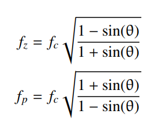

*Şekil 2.1 - Type-3 compensator için kullanılan frekans ilişkileri.*

Bu koşulları birleştirip, tüm frekansları yatay eksende büyüklük sırasına göre sıraladım.

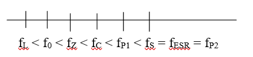

*Şekil 2.2 - Tasarımda kullanılan frekansların hedef sıralaması.*

Denklemi belli olan frekanslar ve seçimini bizim yaptığımız parametreler var:

- $f_{ESR} = \dfrac{1}{2 \pi C R_{ESR}}$
- $f_0 = \dfrac{1}{2 \pi \sqrt{CL}}$
- $f_s = 100\,\text{kHz}$ ve $\theta = 52^\circ$

Yukarıdaki tüm koşullar ve denklemler dikkate alınarak hesaplama yaptığımızda:

$$
f_s = 100\,\text{kHz}
$$

$$
f_{p2} = f_{ESR} = f_s = 100\,\text{kHz}
$$

$$
f_{ESR} = \frac{1}{2 \pi C R_{ESR}} = 100\,\text{kHz}
$$

Buradan:

$$
C R_{ESR} = 1.59\,\mu
$$

elde edilir.

Diğer frekans seçimleri:

- $f_c = f_s / 10 = 10\,\text{kHz}$
- $f_z = 3.44\,\text{kHz}$
- $f_{p1} = 29\,\text{kHz}$
- $f_L \le 1\,\text{kHz}$ olduğundan $f_L = 1\,\text{kHz}$ seçildi.

Tasarım şartı:

$$
f_L < f_0 < f_z
$$

olduğu için:

$$
1\,\text{kHz}
<
\frac{1}{2 \pi \sqrt{CL}}
<
3.44\,\text{kHz}
$$

Buradan:

$$
2.44\,\text{n} < CL < 25.3\,\text{n}
$$

sonucu elde edilir.

Kontrolcü kısmından elde edilip güç hesabında kullanılacak iki ana kısıt:

$$
2.44\,\text{n} < CL < 25.3\,\text{n}
$$

ve

$$
C R_{ESR} = 1.59\,\mu
$$

## 2.2. Hesaplamalarda Kullanılacak Parametreler

| Parametre | Değer |
|---|---:|
| Giriş gerilimi, $V_{in,max}$ | $36\,\text{V}$ |
| Giriş gerilimi, $V_{in,min}$ | $24\,\text{V}$ |
| Çıkış gücü | $50\,\text{W} - 125\,\text{W}$ |
| Çıkış gerilimi, $V_o$ | $14\,\text{V}$ |
| Minimum çıkış akımı, $I_{o,min}$ | $\dfrac{50\,\text{W}}{14\,\text{V}} = 3.571\,\text{A}$ |
| Maksimum çıkış akımı, $I_{o,max}$ | $\dfrac{125\,\text{W}}{14\,\text{V}} = 8.92\,\text{A}$ |
| Çıkış gerilimi tepeden tepeye dalgalanma, $\Delta V_o$ | $0.100\,\text{V}$ |
| Minimum yük direnci, $R_{load,min}$ | $\dfrac{V_o}{I_{o,max}} = \dfrac{14\,\text{V}}{8.92\,\text{A}} = 1.569\,\Omega$ |
| Maksimum yük direnci, $R_{load,max}$ | $\dfrac{V_o}{I_{o,min}} = \dfrac{14\,\text{V}}{3.57\,\text{A}} = 3.921\,\Omega$ |

# 3. Güç Katı Hesaplamaları

Buck converter, en yüksek giriş gerilimindeyken ($36\,\text{V}$), en yüksek gücü ($125\,\text{W}$) verebilecek biçimde tasarlandı. Yüksek gerilimdeyken duty cycle $D$ daha düşük olmak zorunda.

Küçük $D$; ana MOSFET'in daha kısa süre iletimde kalması, bobin ve sığacın dolması için daha az süreleri var demektir. Dolmaları için tanınan süre daha kısa olsa da aynı miktarda enerjiyi depolamak zorundalar; yüksek akım çekmeliler ve yüksek gerilime çıkabilmelidirler. Sabit çıkış gerilimi için bu, $L$ ve $C$ değerlerinin büyümesi anlamına gelir.

Yüksek çıkış gücü de düşük güce göre zorlayıcı durumdur.

## 3.1. İlk Güç Katı Hesapları

| Adım | Hesap / seçim | Sonuç / yorum |
|---|---|---|
| Adım 1: Duty cycle aralığını belirlemek | $\dfrac{V_o}{V_{in,max}} \le D \le \dfrac{V_o}{V_{in,min}}$  $\dfrac{14\,\text{V}}{36\,\text{V}} \le D \le \dfrac{14\,\text{V}}{24\,\text{V}}$ | $D_{min} = 0.3888$ $D_{max} = 0.5833$ |
| Adım 2: Anahtarlama frekansı | $f_s = 100\,\text{kHz}$ | Bu değer frekans planında seçilmişti. |
| Adım 3: Tepeden tepeye bobin akımı dalgalanması | $\Delta I_L = 0.2 \times I_{o,max}$ $= 0.2 \times 8.92$ $= 1.784\,\text{A}$ | İlk hesap değeri. Bobin akımının $I_{o,max}$ akımının yüzde 20'si kadar tepeden tepeye dalgalanması istendi. Kaynaklar bobin akımı dalgalanma oranının yüzde 20-40 arasında seçilebileceğini belirtiyor. |
| Adım 4: Bobin değerinin hesaplanması | $L = \dfrac{V_o(1-D_{min})}{\Delta I_L f_s}$ $= \dfrac{14(1-0.3888)}{1.784 \times 100\,\text{kHz}}$ | $L = 47.94\,\mu\text{H}$ ilk hesap değeri. |
| Adım 5: Sığacın hesaplanması | $C_{min} = \dfrac{1-D_{min}}{8L(\Delta V_o/V_o)f_s^2}$ $= \dfrac{1-0.3888}{8(47.94\,\mu\text{H})(0.1/14)(100\,\text{kHz})^2}$ | $C \ge 22.3\,\mu\text{F}$ ilk hesap değeri. |
| Adım 6: Sığacın izin verilen en yüksek ESR değeri | $ESR \le \dfrac{\Delta V_o}{\Delta I_L}$ $ESR \le \dfrac{0.1}{1.784}$ | $ESR \le 56\,\text{m}\Omega$ ilk hesap değeri. |
| Adım 7: Frekans kısıtlarıyla kontrol | Önceki frekans kısıtları: $2.44\,\text{n} < CL < 25.3\,\text{n}$ ve $C R_{ESR} = 1.59\,\mu$ | $C \ge 22.3\,\mu\text{F}$, $L = 47.94\,\mu\text{H}$, $ESR \le 56\,\text{m}\Omega$ değerleri birlikte kontrol edildi. |

İlk sığaç hesabı ile $C R_{ESR}$ koşulunu kontrol edersek:

$$
R_{ESR} \approx \frac{1.59\,\mu}{22\,\mu\text{F}} = 71.3\,\text{m}\Omega
$$

Bu değer $56\,\text{m}\Omega$ sınırına yakın fakat koşulu sağlamıyor gibi görünür. Sığacın capacitance değeri arttıkça ESR değeri düşme eğilimindedir. Bu yüzden $C$ biraz artırılıp $ESR$ biraz düşürülerek:

$$
C R_{ESR} = 1.59\,\mu
$$

koşulunu sağlamak mümkündür.

ESR koşulunu sağlamak için:

$$
C > 28.4\,\mu\text{F}
$$

olması gerekir.

$L$ sabit $47.94\,\mu\text{H}$ tutulursa, rezonans frekansı şartını sağlayacak sığaç aralığı yaklaşık:

$$
44\,\mu\text{F} < C < 527\,\mu\text{F}
$$

olmalıdır. Bu aralık, aşağıdaki rezonans frekansı şartını korumak içindir:

$$
f_L < f_0 < f_z
$$

yani:

$$
1\,\text{kHz} < f_0 < 3.44\,\text{kHz}
$$

Bu nedenle:

$$
C = 82\,\mu\text{F}
$$

değerinde bir sığaç seçildi. Çünkü $82\,\mu\text{F}$ sığacın ESR değeri yaklaşık $20\,\text{m}\Omega$ mertebesindedir. Böylece:

$$
C R_{ESR} \approx 1.59\,\mu
$$

koşulu sağlanmış olur.

$f_0 = 2.5\,\text{kHz}$ ve $C = 82\,\mu\text{F}$ iken bobin değeri:

$$
f_0 = \frac{1}{2\pi\sqrt{LC}}
$$

bağıntısından:

$$
L \approx 49.42\,\mu\text{H}
$$

olarak bulunur.

Yeni $L$ ve $C$ değerlerine göre hesap yenilenmelidir.

## 3.2. Güncellenmiş L ve C Değerleriyle Hesaplar

| Adım | Hesap / sonuç | Yorum |
|---|---|---|
| Adım 8: Bobin akımı dalgalanması | $\Delta I_L = \dfrac{V_o(1-D_{min})}{L f_s}$ $\Delta I_L \approx 1.714\,\text{A}$ | Bobin değeri arttığı için bobin akımının tepeden tepeye dalgalanması azaldı. |
| Adım 9: Bobin tepe akımı | $I_{L,tepe} = I_{o,max} + \dfrac{\Delta I_L}{2}$ $= 8.92 + \dfrac{1.714}{2}$ | $I_{L,tepe} = 9.777\,\text{A}$ |
| Adım 9.2: Bobin en küçük akımı | $I_{L,küçük,tepe} = I_{o,min} - \dfrac{\Delta I_L}{2}$ $= 3.571 - \dfrac{1.714}{2}$ | $I_{L,küçük,tepe} = 2.714\,\text{A} > 0\,\text{A}$ olduğundan converter CCM'de kalır. |
| Adım 10: Bobin RMS akımı | $I_{L,RMS} = \sqrt{I_L^2 + \left(\dfrac{\Delta I_L/2}{\sqrt{3}}\right)^2}$ $I_{L,RMS} = \sqrt{10.634^2 + \left(\dfrac{1.714/2}{\sqrt{3}}\right)^2}$ | $I_{L,RMS} = 10.645\,\text{A}$ |
| Adım 11: Yeni C ve L ile çıkış dalgalanması | $\Delta V_o = \dfrac{V_o(1-D_{min})}{8LCf_s^2}$ $= \dfrac{14(1-0.3888)}{8(47.94\,\mu\text{H})(82\,\mu\text{F})(100\,\text{kHz})^2}$ | $\Delta V_o \approx 27\,\text{mV}$ |
| Adım 12: Sığaç RMS akımı | $I_{C,RMS} = \sqrt{I_C^2 + \left(\dfrac{\Delta I_C/2}{\sqrt{3}}\right)^2}$ $I_{C,RMS} = \sqrt{0^2 + \left(\dfrac{1.714/2}{\sqrt{3}}\right)^2}$ | $I_{C,RMS} = 0.4947\,\text{A}$; sığaç bu akıma dayanabilmelidir. |

$L$ ve $C$ değerlerinin artışı, çıkıştaki gerilim dalgalanmasını $100\,\text{mV}$ seviyesinden yaklaşık $27\,\text{mV}$ seviyesine düşürdü. Bu, kapalı çevrimin frekanslarının yerlerini tasarım sürecinin en başından itibaren gözetmenin bir sonucu olarak değerlendirilebilir.

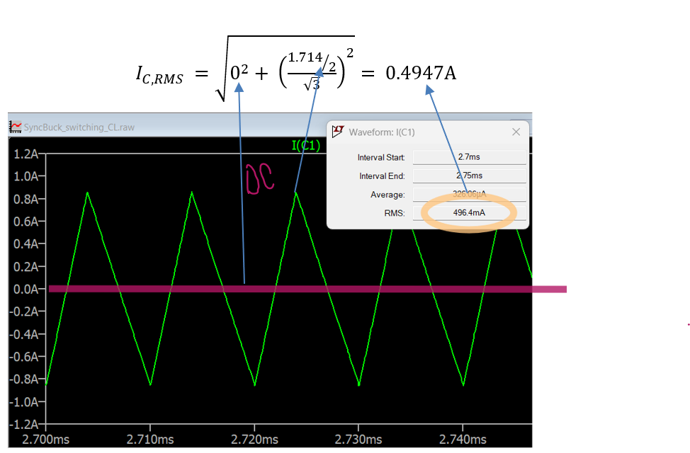

*Şekil 3.1 - Kaynak DOCX'teki güç katı hesap akışında kullanılan devre/hesap görseli.*

## 3.3. Duty Cycle Hesabının LTspice ile Kontrolü

Adım 1'de yapılan duty cycle hesabı LTspice benzetiminde kontrol edildi. Steady-state iken, giriş gerilimi $36\,\text{V}$ olduğunda:

$$
3.91\,\mu\text{s} \approx D_{min}\left(\frac{1}{100\,\text{kHz}}\right)
$$

olarak görülmektedir. Bu değer hesaplanan $D_{min}$ ile uyumludur.

Benzer şekilde giriş gerilimi $24\,\text{V}$ iken $D_{max}$ olduğu görülebilir. Ayrıca bu $D_{min}$ ve $D_{max}$ değerleri steady-state için geçerlidir. Transient durumlarında kontrolcünün verdiği emirle $D$, yaklaşık $0.9$ ile $0.1$ arasında değişir.

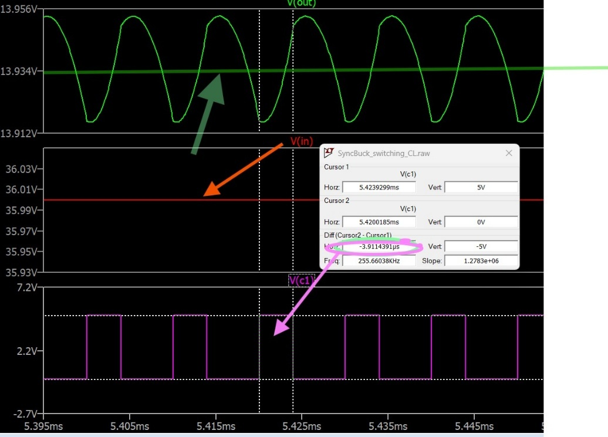

*Şekil 3.2 - 36 V girişte steady-state duty-cycle kontrolü.*

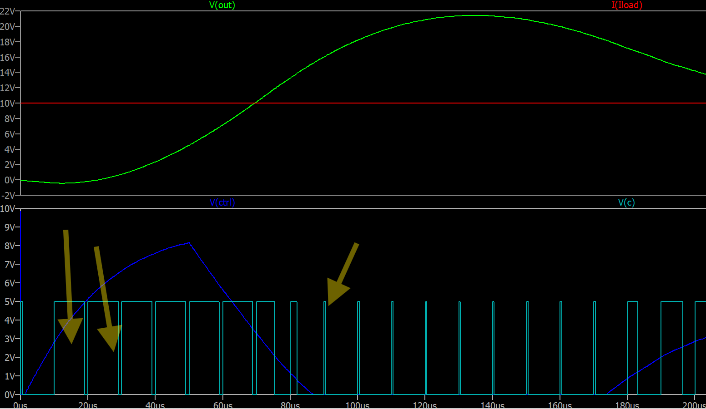

*Şekil 3.3 - 24 V girişte duty-cycle davranışı ve LTspice kontrolü.*

## 3.4. Güç Katı Değer Özeti

| Büyüklük | Değer |
|---|---:|
| Giriş gerilimi, $V_{s,max}$ | $36\,\text{V}$ |
| Giriş gerilimi, $V_{s,min}$ | $24\,\text{V}$ |
| Maksimum çıkış gücü, $P_{max}$ | $125\,\text{W}$ |
| Minimum çıkış gücü | $50\,\text{W}$ |
| Çıkış gerilimi, $V_o$ | $14\,\text{V}$ |
| Çıkış gerilimi tepeden tepeye dalgalanma | $\Delta V_o \approx 27\,\text{mV}$ |
| Sığaç | $C = 82\,\mu\text{F}$ |
| Sığaç ESR | $R_{ESR} = 19.39\,\text{m}\Omega$ |
| MOSFET iletim direnci | $R_{DS(on)} = 15\,\text{m}\Omega$ |
| Bobin seri direnci | $R_L = 15\,\text{m}\Omega$ |
| Minimum yük direnci | $R_{load,min} = 1.569\,\Omega$ |
| Maksimum yük direnci | $R_{load,max} = 3.921\,\Omega$ |
| Minimum duty cycle | $D_{min} = 0.3888$ |
| Maksimum duty cycle | $D_{max} = 0.5833$ |

# 4. Çevirici Durum Denklemleri

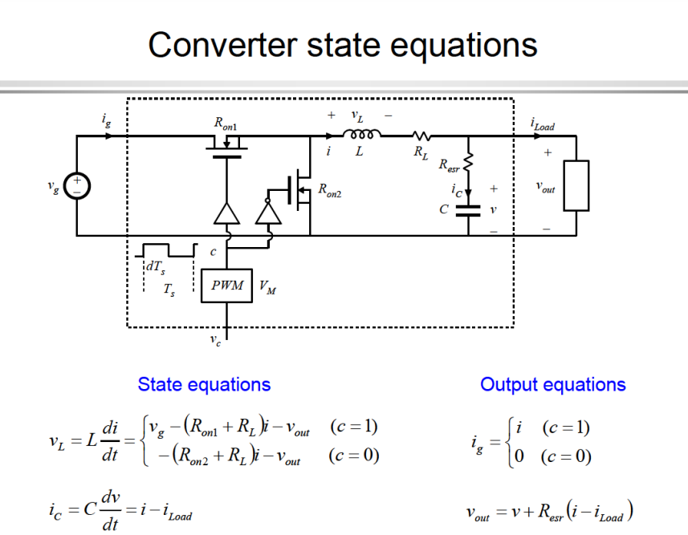

*Şekil 4.1 - Kaynak DOCX'teki buck converter durum denklemleri.*

Zaman alanında buck converter'ın tüm davranışını temsil eden bu denklemleri, LTspice benzetim sonuçları ile denklemlerden birkaçını doğrulamaya çalışacağım.

## 4.1. ESR Etkisi

ESR etkisi çıkış gerilimini doğrudan etkiler. Kaynak belgede kullanılan ifade:

$$
V_{out} = v + R_{ESR}(i - i_{load})
$$

şeklindedir.

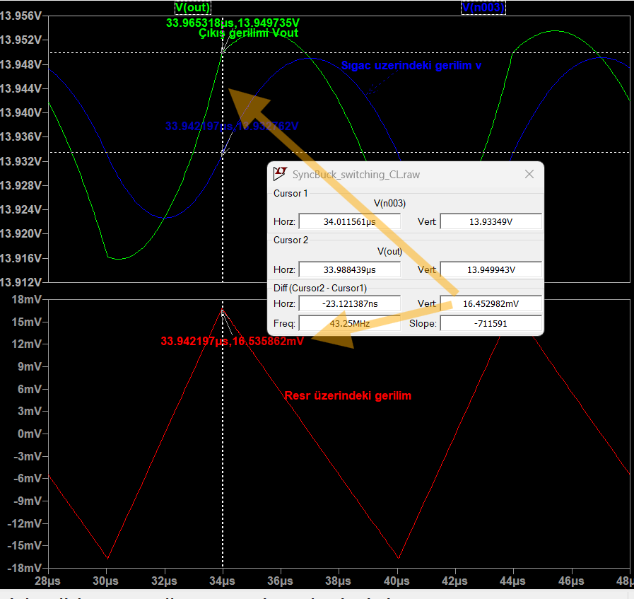

*Şekil 4.2 - ESR'nin çıkış gerilimi dalgalanmasını artıran etkisi.*

Bu görsel ve ifade ile ESR direncinin neden düşük tutulması gerektiği gösterilmiş olur. ESR, çıkış gerilimindeki dalgalanmayı artırır; bu nedenle sığaç seçimi yalnızca kapasite değerine göre değil, ESR davranışına göre de yapılmalıdır.

Kaynak belgede ESR etkisi sonrasında akım ve gerilimlerin genel dalga biçimlerine geçilir.

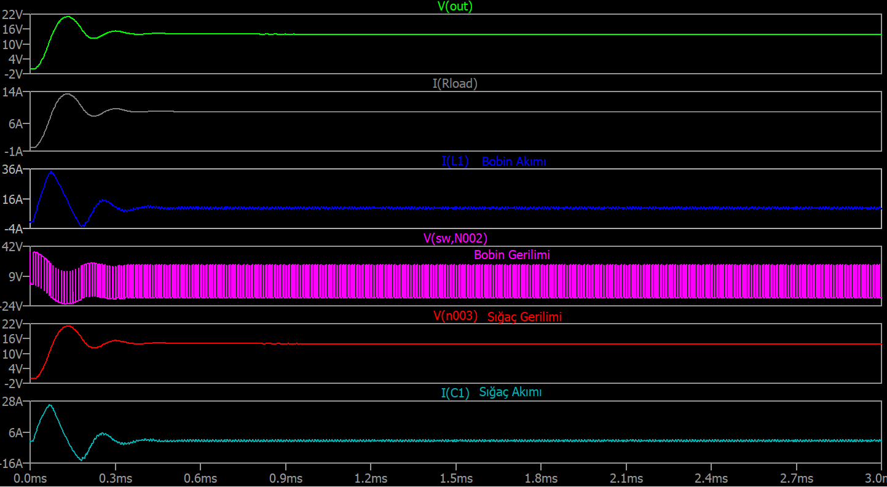

*Şekil 4.3 - Buck converter için genel akım ve gerilim dalga biçimleri.*

## 4.2. Genel Dalga-Biçimleri

Genel dalga biçimleri bölümünde, anahtarlama periyodu boyunca akım ve gerilimlerin nasıl değiştiği gösterilir. Bu kısım, güç katı hesaplarında kullanılan $D$, $D'$, $\Delta I_L$, çıkış sığacı akımı ve çıkış gerilimi dalgalanması ilişkilerini görsel olarak destekler.

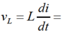

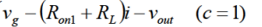

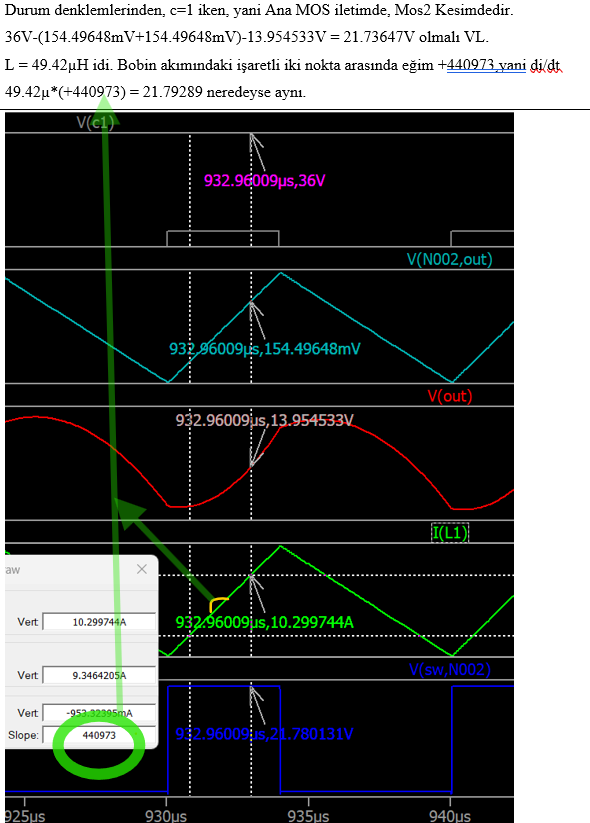

*Şekil 4.4 - Buck converter akım ve gerilim dalga biçimleri.*

> TODO: Kaynak DOCX bu noktada `image12.png` ve `image13.png` adlı iki adet 2x2 piksel medya nesnesi de içeriyor. Bunlar görünür teknik figür gibi durmadığı için ana akışa gömülmedi; PDF ile karşılaştırılarak boş/artefakt oldukları doğrulanmalı.

# 5. Kontrolcü Tasarımı

Amaç, çıkış gerilimini sabit ve iyi kontrol edilmiş bir değerde tutmaktır. Bu bölümde önce küçük işaret modelinden açık çevrim transfer fonksiyonuna gidilir; ardından uncompensated loop gain üzerinden gerekli kompanzasyon kazancı ve faz katkısı belirlenir. Son olarak lead, lag ve PID birleşimi op-amp ile gerçekleştirilecek devreye bağlanır.

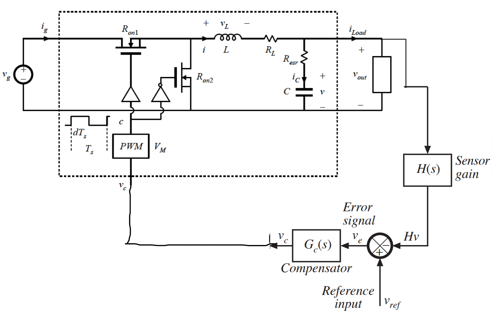

*Şekil 5.1 - Kaynak DOCX'te kontrolcü tasarımına girişte verilen diyagram.*

## 5.1. Sistem Block Diagramı ve Küçük İşaret Modeli

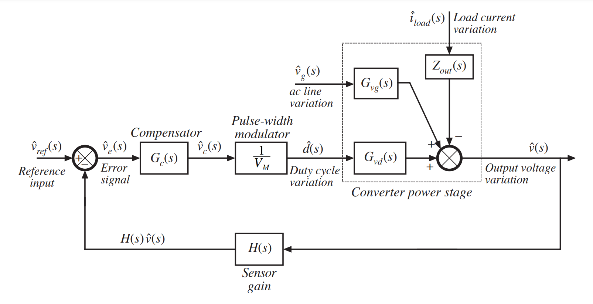

*Şekil 5.2 - Buck converter, sensor gain, PWM ve compensator bloklarını içeren kontrol sistemi.*

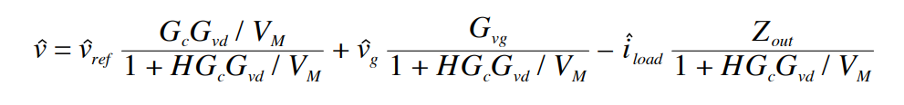

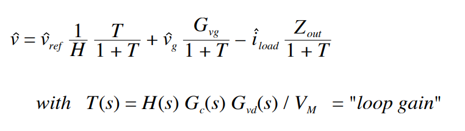

*Şekil 5.3 - Küçük işaret modelinde kullanılan kapalı çevrim ifade ilişkileri.*

Küçük işaret AC modeli kullanıldı. Bu modelde $T(s)$ kontrolcünün açık çevrim transfer fonksiyonudur. $T(s)$ çevrim kazancı yüksek tasarlanarak çıkışın sadece referansı takip etmesi ve bozucuların etkilerinin en aza indirilmesi hedeflenir. Kaynak belgede özellikle giriş gerilimi ve yük akımı bozucuları:

$$
\hat{v}_g,\qquad \hat{i}_{load}
$$

olarak gösterilir.

## 5.2. Kontrolcü Hesabı

PWM rampa genliği ve referans gerilimi:

$$
V_m = 4\,\text{V}
$$

$$
V_{ref} = 1.8\,\text{V}
$$

olarak belirlendi. Bu değerler kullanılacak PWM ve op-amp çalışma aralığı ile uyumludur.

### 5.2.1. Sensor Gain, $H(s)$

Sensör kazancı, sıfır hata durumunda çıkış gerilimini referans gerilimine ölçekleyecek şekilde seçilir:

$$
V_e = V_{ref} - H V
$$

Sıfır hata için:

$$
0 = 1.8 - H \cdot 14
$$

Dolayısıyla:

$$
H \cdot V = 1.8
$$

ve:

$$
H = \frac{1.8}{14} = 0.12857
$$

olmalıdır. Sensör kazancı yaklaşık:

$$
H \approx 0.12857
$$

olarak alınır.

### 5.2.2. Control-to-Output Transfer Fonksiyonu, $G_{vd}(s)$

$G_{vd}(s)$, duty cycle küçük işaret değişiminin çıkış gerilimine etkisini gösteren control-to-output transfer fonksiyonudur:

$$
G_{vd}(s) = \frac{\hat{v}}{\hat{d}}
$$

Bu transfer fonksiyonu çeviricinin fiziksel bileşenlerinden türetilir. $\hat{d}(t)$ üzerindeki küçük değişimlerin çıkış gerilimine olan etkisini inceler. Çıkış geriliminin istenen seviyede tutulabilmesi için $\hat{d}(t)$ değerinin nasıl ayarlanması gerektiği bu fonksiyonla belirlenir.

Kaynak belgede kullanılan form:

$$
G_{vd}(s)
=
\frac{V}{D}
\cdot
\frac{1 + \frac{s}{\omega_{ESR}}}
{1 + \frac{1}{Q}\frac{s}{\omega_0} + \left(\frac{s}{\omega_0}\right)^2}
$$

Burada rezonans kutup çifti frekansı:

$$
f_0 = \frac{1}{2\pi\sqrt{LC}}
$$

ve seçilen değerlerle:

$$
f_0 = \frac{1}{2\pi\sqrt{82\,\mu\text{F}\cdot 49.42\,\mu\text{H}}}
\approx 2.5\,\text{kHz}
$$

ESR sıfırı:

$$
f_{ESR} = \frac{1}{2\pi C R_{ESR}}
$$

olup:

$$
f_{ESR}
=
\frac{1}{2\pi \cdot 82\,\mu\text{F}\cdot 19.39\,\text{m}\Omega}
\approx 100\,\text{kHz}
$$

olarak bulunur.

Kayıp kaynaklı kalite faktörü:

$$
Q_{loss}
=
\frac{\sqrt{L/C}}{R_{ESR}+R_L}
=
\frac{\sqrt{49.42\,\mu\text{H}/82\,\mu\text{F}}}{19.39\,\text{m}\Omega + 30\,\text{m}\Omega}
$$

$$
Q_{loss} = 15.718 \quad \text{veya} \quad 23.92\,\text{dB}
$$

Yük kaynaklı kalite faktörü:

$$
Q_{load}
=
\frac{R}{\sqrt{L/C}}
=
\frac{1.569}{\sqrt{49.42\,\mu\text{H}/82\,\mu\text{F}}}
=
2.02
$$

Bu değer dB olarak yaklaşık:

$$
20\log_{10}(2.02)=6.112\,\text{dB}
$$

Toplam kalite faktörü paralel birleşim olarak alınır:

$$
Q = Q_{loss}\parallel Q_{load}
=
\frac{Q_{loss}Q_{load}}{Q_{loss}+Q_{load}}
$$

$$
Q
=
\frac{15.718\cdot 2.02}{15.718+2.02}
=
1.789
<
2.02
$$

Böylece control-to-output transfer fonksiyonu sayısal olarak:

$$
G_{vd}(s)
=
\frac{14}{0.3888}
\cdot
\frac{1 + \frac{s}{2\pi\cdot 100\,\text{kHz}}}
{1 + \frac{1}{1.789}\frac{s}{2\pi\cdot 2.5\,\text{kHz}}
+ \left(\frac{s}{2\pi\cdot 2.5\,\text{kHz}}\right)^2}
$$

şeklinde yazılabilir.

PWM kazancı dahil edildiğinde düşük frekans kazancı:

$$
G_{vd0}\cdot\frac{1}{V_m}
=
\frac{14}{0.3888}\cdot\frac{1}{4}
\approx 9
$$

yani:

$$
20\log_{10}(9) \approx 19.08\,\text{dB}
$$

olur.

## 5.3. Uncompensated Loop Gain

Compensator etkisi henüz yokken $G_c(s)=1$ alınır ve açık çevrim kazancı $T_u(s)$ hesaplanır.

Genel açık çevrim transfer fonksiyonu:

$$
T(s)
=
H_{sense}
\cdot
\frac{1}{V_m}
\cdot
G_{vd}(s)
\cdot
G_c(s)
$$

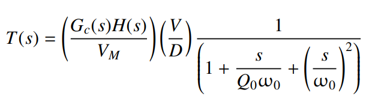

*Şekil 5.4 - $T(s)$ açık çevrim transfer fonksiyonunun kaynak DOCX'teki gösterimi.*

Uncompensated durumda:

$$
T_u(s)
=
H_{sense}
\cdot
\frac{1}{V_m}
\cdot
G_{vd}(s)
\cdot
1
$$

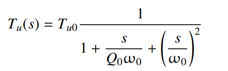

*Şekil 5.5 - $T_u(s)$ uncompensated loop gain ifadesi.*

Düşük frekans kazancı:

$$
T_{u0}
=
H
\cdot
\frac{1}{V_m}
\cdot
\frac{V}{D}
$$

Sayısal olarak:

$$
T_{u0}
=
0.12857
\cdot
\frac{1}{4}
\cdot
\frac{14}{0.3888}
\approx
1.15713
$$

Bu değer dB cinsinden yaklaşık:

$$
20\log_{10}(1.15713) \approx 1.27\,\text{dB}
$$

olur.

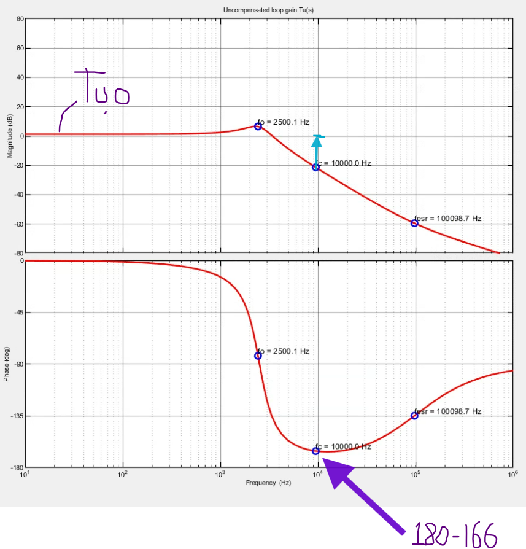

*Şekil 5.6 - Compensator eklenmeden önce açık çevrim Bode diyagramı.*

Uncompensated kazancı hesaplamaktaki amaç, compensator'den ne kadar kazanç elde edilmesi gerektiğini bulmaktır. Hedeflenen crossover frekansı:

$$
f_c = \frac{f_s}{10} = 10\,\text{kHz}
$$

olarak seçildi. Bu frekansta loop gain'i $0\,\text{dB}$ seviyesine çıkarmak için yaklaşık:

$$
22.3\,\text{dB}
$$

kazanç artışı gerekir.

Ayrıca hedef $f_c$ noktasındaki phase margin yaklaşık $14^\circ$ seviyesindedir. Loop gain içinde pratik devre ve model kaynaklı ek bozulmalar da olacağı için gerçek phase margin bunun da altına düşebilir. Bu nedenle faz katkısı sağlayan bir lead compensator gereklidir.

## 5.4. Lead (PD) Compensator Eklenmesi

Lead compensator ile hedef:

$$
f_c \approx 10\,\text{kHz}
$$

ve:

$$
PM \approx 53^\circ
$$

olarak seçildi. Phase margin'in $53^\circ$ seçilmesinin nedeni, kapalı çevrim $Q$ factor değerini yaklaşık $1$ yapan dengeli bir noktaya karşılık gelmesidir. Bu seçim hem kararlı hem de hızlı tepki için uygun bir denge sağlar.

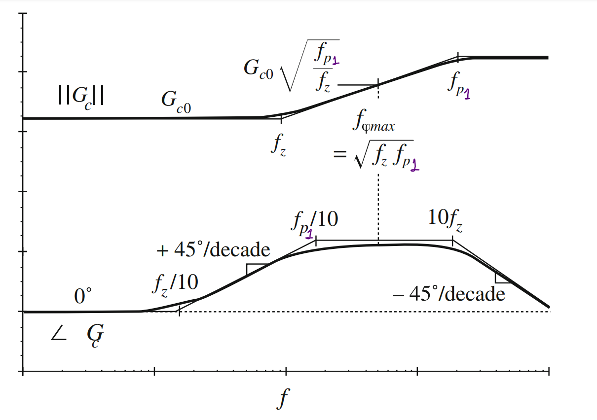

*Şekil 5.7 - Lead compensator'ın faz artırıcı Bode davranışı.*

Lead compensator transfer fonksiyonu:

$$
G_c(s)
=
G_{c0}
\frac{1+\frac{s}{\omega_z}}
{1+\frac{s}{\omega_{p1}}}
$$

şeklinde yazılır. Eklenen lead compensator'ın sıfırı $f_z$ frekansında, kutbu ise $f_{p1}$ frekansındadır. Kutup, sıfırdan daha yüksek frekanstadır.

Lead compensator'ın phase margin'i en çok artırdığı frekans:

$$
f_{\varphi,max}
=
\sqrt{f_z f_{p1}}
$$

frekansıdır. Üstteki Bode diyagramı da bunu gösterir. Faz katkısının hedef crossover frekansında en yüksek olması istendiğinden:

$$
f_c
=
10\,\text{kHz}
=
f_{\varphi,max}
=
\sqrt{f_z f_{p1}}
$$

ve:

$$
\theta = 53^\circ
$$

olarak alınır.

Lead compensator frekansları:

$$
f_z
=
f_c
\sqrt{\frac{1-\sin(\theta)}{1+\sin(\theta)}}
$$

$$
f_z
=
10\,\text{kHz}
\sqrt{\frac{1-\sin(53^\circ)}{1+\sin(53^\circ)}}
\approx
3.44\,\text{kHz}
$$

ve:

$$
f_{p1}
=
f_c
\sqrt{\frac{1+\sin(\theta)}{1-\sin(\theta)}}
$$

$$
f_{p1}
=
10\,\text{kHz}
\sqrt{\frac{1+\sin(53^\circ)}{1-\sin(53^\circ)}}
\approx
29\,\text{kHz}
$$

olarak bulunur.

Bu frekans değerleri güç katı tasarımında zaten dikkate alınmıştı. Böylece güç katı ile kontrolcü tasarımı birbirinden kopuk değil, aynı frekans planını sağlayacak şekilde seçilmiş olur.

Lead compensator'ın DC kazancı:

$$
G_{c0}
=
\frac{1}{T_{u0}}
\left(\frac{f_c}{f_0}\right)^2
\sqrt{\frac{f_z}{f_{p1}}}
$$

Sayısal olarak:

$$
G_{c0}
=
\frac{1}{1.15713}
\left(\frac{10\,\text{kHz}}{2.5\,\text{kHz}}\right)^2
\sqrt{\frac{3.44\,\text{kHz}}{29\,\text{kHz}}}
$$

$$
G_{c0}
\approx
4.762
$$

Bu değer dB olarak:

$$
20\log_{10}(4.762)
\approx
13.56\,\text{dB}
$$

olur.

Lead compensator'ın $f_c$ frekansındaki kazancı:

$$
G_c(f_c)
=
G_{c0}
\sqrt{\frac{f_{p1}}{f_z}}
$$

$$
G_c(f_c)
=
4.762
\sqrt{\frac{29\,\text{kHz}}{3.44\,\text{kHz}}}
\approx
13.826
$$

Bu da:

$$
20\log_{10}(13.826)
\approx
22.8\,\text{dB}
$$

kazanç artışına karşılık gelir. Sonuç, hedeflenen $f_c$ frekansında ihtiyaç duyulan yaklaşık $22.3\,\text{dB}$ artışla uyumludur.

Lead compensator değerleriyle Bode diyagramı çizdirilirken, ileride açıklanacak op-amp kutbu da transfer fonksiyonuna eklendi. Bu op-amp kutbu:

$$
f_{p2} = 100\,\text{kHz}
$$

olarak alınır.

Bu durumda lead compensator:

$$
G_c(s)
=
G_{c0}
\frac{1+\frac{s}{\omega_z}}
{\left(1+\frac{s}{\omega_{p1}}\right)
\left(1+\frac{s}{\omega_{p2}}\right)}
$$

ve sayısal olarak:

$$
G_c(s)
=
4.762
\frac{1+\frac{s}{2\pi\cdot 3.44\,\text{kHz}}}
{\left(1+\frac{s}{2\pi\cdot 29\,\text{kHz}}\right)
\left(1+\frac{s}{2\pi\cdot 100\,\text{kHz}}\right)}
$$

şeklindedir.

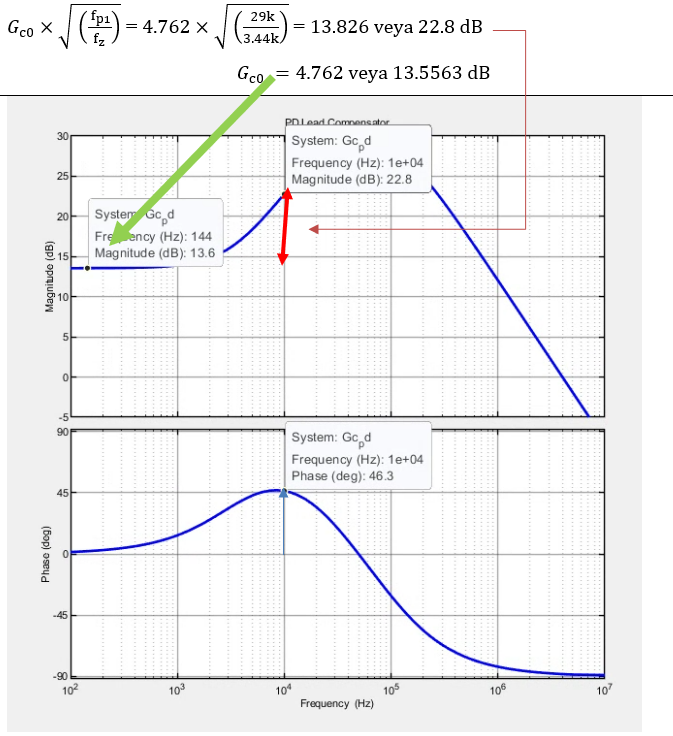

*Şekil 5.8 - Lead compensator'ın Bode diyagramı.*

Lead compensator eklenmiş haliyle açık çevrim $T(s)$ Bode diyagramı:

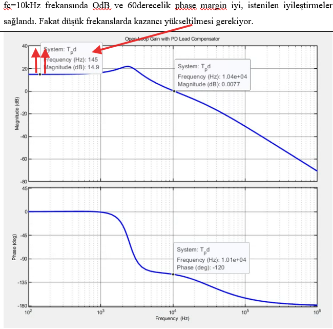

*Şekil 5.9 - Lead compensator eklendikten sonra açık çevrim $T(s)$ Bode diyagramı.*

## 5.5. Lag (PI) Compensator Eklenmesi

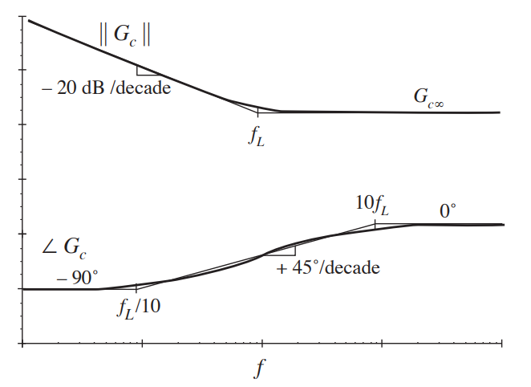

*Şekil 5.10 - Lag/PI compensator'ın düşük frekans kazancı artıran davranışı.*

Lag compensator transfer fonksiyonu:

$$
G_c(s)
=
G_{c\infty}
\left(1+\frac{\omega_L}{s}\right)
$$

şeklinde yazılır. Daha önce:

$$
f_L = 1\,\text{kHz}
$$

seçilmişti. Pratik kural olarak $f_L$, $f_c$'den en az 10 kat düşük olmalıdır. Burada:

$$
f_L = \frac{f_c}{10}
$$

koşulu sağlanmaktadır.

Eklenen sıfır normal sıfırdan farklıdır; kaynak belgede "inverted zero" olarak not edilmiştir.

Lag ve lead kazançlarının birleştirileceği ortak kazanç:

$$
G_{c0} = G_{c\infty} = G_{cm}
$$

olarak alınır.

$$
G_{c\infty} = 4.762
$$

Böylece lag compensator:

$$
G_c(s)
=
4.762
\left(1+\frac{2\pi\cdot 1\,\text{kHz}}{s}\right)
$$

şeklindedir.

## 5.6. PID Compensator Birleştirilmiş Hali

Lead ve lag parçaları birleştirildiğinde kullanılacak PID compensator:

$$
G_c(s)
=
G_{cm}
\frac{
\left(1+\frac{s}{\omega_z}\right)
\left(1+\frac{\omega_L}{s}\right)
}{
\left(1+\frac{s}{\omega_{p1}}\right)
\left(1+\frac{s}{\omega_{p2}}\right)
}
$$

olur.

Sayısal değerlerle:

$$
G_c(s)
=
4.762
\frac{
\left(1+\frac{s}{2\pi\cdot 3.44\,\text{kHz}}\right)
\left(1+\frac{2\pi\cdot 1\,\text{kHz}}{s}\right)
}{
\left(1+\frac{s}{2\pi\cdot 29\,\text{kHz}}\right)
\left(1+\frac{s}{2\pi\cdot 100\,\text{kHz}}\right)
}
$$

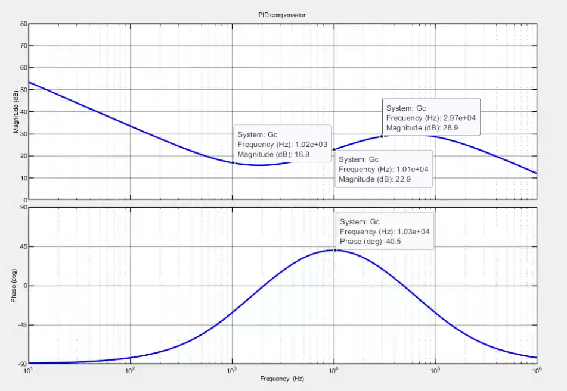

*Şekil 5.11 - Kullanılacak $G_c(s)$ PID compensator Bode eğrisi.*

## 5.7. Op-Amp ve Kutup Etkisi

Tasarımda kullanılan LT1215 op-amp'ın yüksek frekanslara doğru gidildikçe kazancını koruyamaması bir kutup ile temsil edilir. Bu kutup:

$$
f_{p2} = 100\,\text{kHz}
$$

olarak eklenmiştir.

Lead compensator'ın yüksek frekanstaki kazanç gereksinimi:

$$
G_{c0}\frac{f_{p1}}{f_z}
=
4.762\frac{29\,\text{kHz}}{3.44\,\text{kHz}}
\approx
40.144
$$

olur. Bu kazanç dB olarak:

$$
20\log_{10}(40.144)
\approx
32.07\,\text{dB}
$$

seviyesindedir.

Op-amp'ın bu kazanç değerini yaklaşık $100\,\text{kHz}$ frekansına kadar verebildiği, aşağıdaki voltage gain vs frequency grafiğinden kontrol edilir.

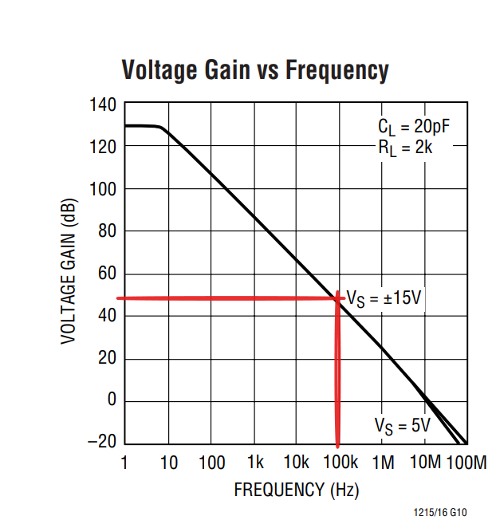

*Şekil 5.12 - LT1215 op-amp için kazanç/frekans kısıtı.*

## 5.8. Açık Çevrim Transfer Fonksiyonu, $T(s)$

Compensator, power stage ve sensor gain bir araya getirildiğinde açık çevrim transfer fonksiyonu:

$$
T(s)
=
H
\cdot
\frac{1}{V_m}
\cdot
G_{vd}(s)
\cdot
G_c(s)
$$

şeklindedir.

Tüm sayısal değerler yerine konulduğunda:

$$
T(s)
=
0.12857
\cdot
\frac{1}{4}
\cdot
\frac{14}{0.3888}
\cdot
\frac{1 + \frac{s}{2\pi\cdot 100\,\text{kHz}}}
{1 + \frac{1}{1.789}\frac{s}{2\pi\cdot 2.5\,\text{kHz}}
+ \left(\frac{s}{2\pi\cdot 2.5\,\text{kHz}}\right)^2}
\cdot
4.762
\frac{
\left(1+\frac{s}{2\pi\cdot 3.44\,\text{kHz}}\right)
\left(1+\frac{2\pi\cdot 1\,\text{kHz}}{s}\right)
}{
\left(1+\frac{s}{2\pi\cdot 29\,\text{kHz}}\right)
\left(1+\frac{s}{2\pi\cdot 100\,\text{kHz}}\right)
}
$$

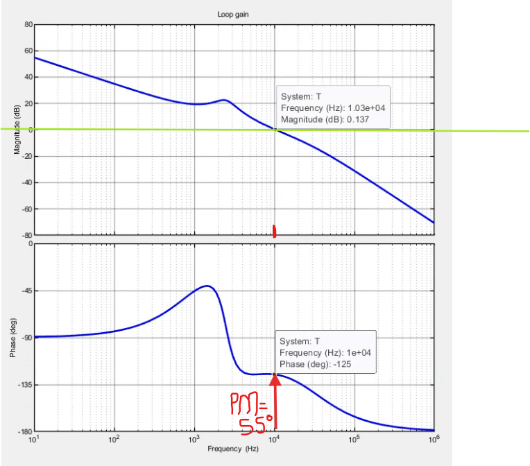

*Şekil 5.13 - Nihai açık çevrim transfer fonksiyonu $T(s)$ için Bode diyagramı.*

Bu Bode diyagramında:

- Phase margin yaklaşık $55^\circ$ olarak görülmektedir.
- Crossover frequency yaklaşık $10.3\,\text{kHz}$ olarak görülmektedir.

Bu sonuç hedeflenen $PM \approx 53^\circ$ ve $f_c \approx 10\,\text{kHz}$ değerleriyle uyumludur.

Kaynak belgede hesaplanan açık çevrim transfer fonksiyonu ayrıca aşağıdaki görsellerle verilmiştir:

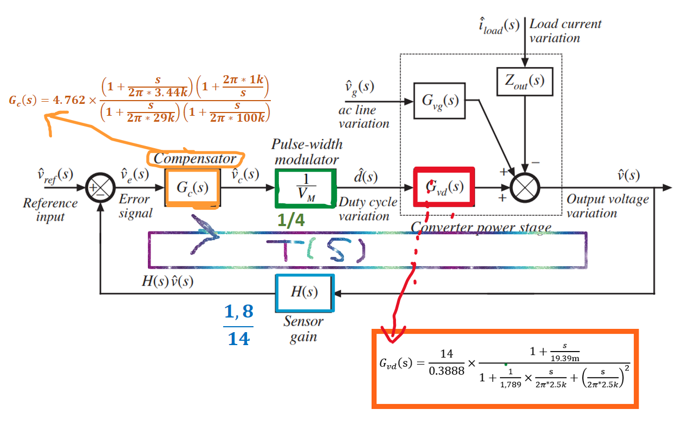

*Şekil 5.14 - Hesaplanan açık çevrim transfer fonksiyonu $T(s)$.*

Hesaplanan $T(s)$ aşağıdaki kapalı çevrim transfer fonksiyonlarında kullanılacaktır.

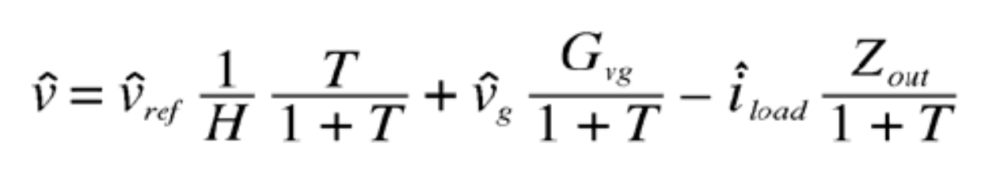

*Şekil 5.15 - $T(s)$ ile kurulan kapalı çevrim ifade.*

> TODO: Kaynak DOCX bu noktada `image30.png` adlı 2x2 piksel bir medya nesnesi içeriyor. Görünür teknik figür gibi durmadığı için ana akışa gömülmedi; PDF ile karşılaştırılarak boş/artefakt olduğu doğrulanmalı.

Kapalı çevrim reference-to-output cevabı mavi grafiktir. Kapalı çevrim bandwidth'i ile açık çevrim crossover frekansı birbirine oldukça yakındır. Kapalı çevrimdeki $1/H$ çarpanı olmasaydı tam eşit olacaktı.

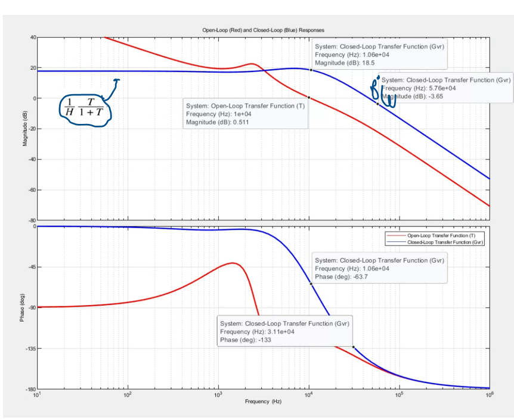

*Şekil 5.16 - Kapalı çevrim reference-to-output cevabı.*

# 6. Op-Amp Devresi Gerçeklemesi

Transfer fonksiyonları bulunduktan sonra geri besleme, direnç ve sığaçlarla uygun şekilde gerçekleştirilecektir. Aşağıdaki ekran görüntüsü bitirilmiş op-amp gerçekleştirmesidir.

> TODO: Kaynak DOCX, Bölüm 6 başlığı çevresinde `image32.png` ve `image33.png` adlı iki adet 3x3 piksel medya nesnesi içeriyor. Bunlar görünür teknik figür gibi durmadığı için ana akışa gömülmedi; PDF ile karşılaştırılarak boş/artefakt oldukları doğrulanmalı.

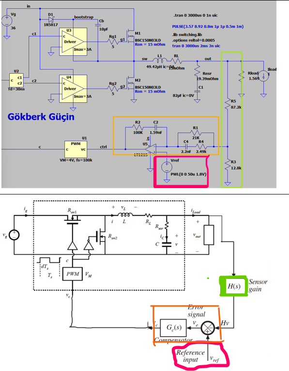

*Şekil 6.1 - Sensor gain ve compensator ağı dahil op-amp gerçekleştirme devresi.*

## 6.1. Sensor Gain, $H(s)$

Sensor gain için gerilim bölücü kullanılır.

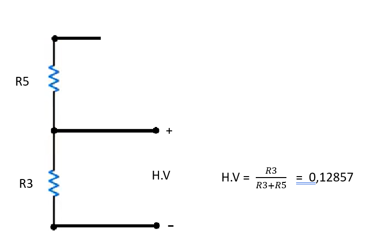

*Şekil 6.2 - $H(s)$ sensor gain için gerilim bölücü.*

Seçilen değerler:

$$
R_3 = 12.8\,\text{k}\Omega
$$

$$
R_5 = 87.2\,\text{k}\Omega
$$

Bu gerilim bölücü yaklaşık:

$$
H
=
\frac{R_3}{R_3+R_5}
=
\frac{12.8}{12.8+87.2}
=
0.128
$$

değerini verir. Bu değer, hesaplanan:

$$
H \approx 0.12857
$$

sensör kazancına pratik olarak yakındır.

## 6.2. Compensator Devresi

Compensator için hedeflenen frekanslar ve kazançlar aşağıdaki Bode davranışına göre belirlenmiştir. Amaç, direnç ve sığaç kullanarak bu Bode eğrisindeki kazanç davranışını elde etmektir.

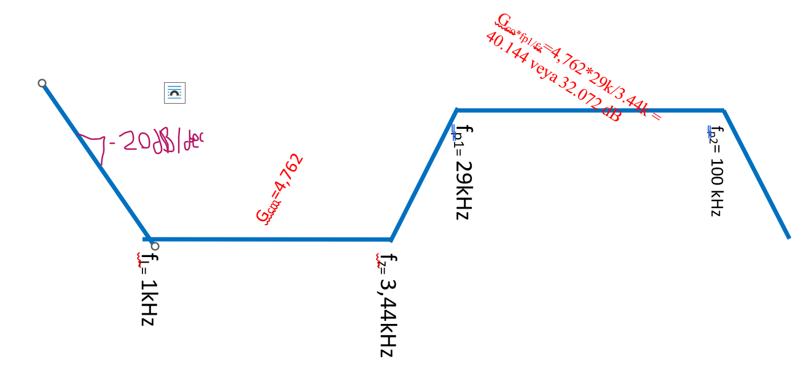

*Şekil 6.3 - Gerçeklenecek compensator frekansları ve kazançları.*

$V_{ref}$ sabit olan bir tasarımda, $V_{ref}$ önündeki empedans ağını kullanmaya gerek yoktur. Bu nedenle sadeleştirilmiş compensator devresi aşağıdaki gibidir.

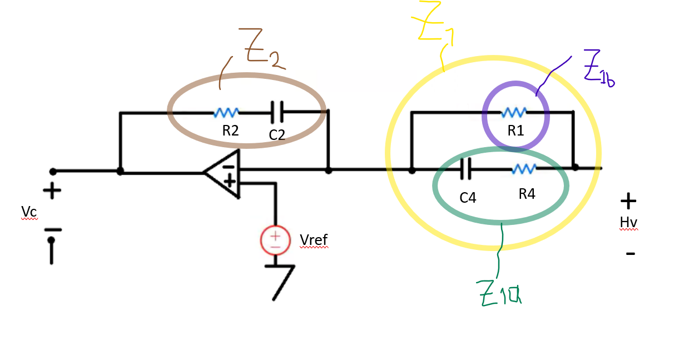

*Şekil 6.4 - $V_{ref}$ sabit olduğunda kullanılan sadeleştirilmiş compensator ağı.*

Op-amp compensator çıkışı:

$$
V_c
=
\frac{Z_2(s)}{Z_1(s)}
\left(V^+ - V^-\right)
$$

şeklinde düşünülebilir.

Kazanç büyüklüğü:

$$
\left|\frac{Z_2(s)}{Z_1(s)}\right|
=
|Z_2(s)|
\cdot
\left|\frac{1}{Z_1(s)}\right|
$$

olarak ayrıştırılır.

### 6.2.1. $R_2$ ve $C_2$ ile Lag Sıfırının Gerçeklenmesi

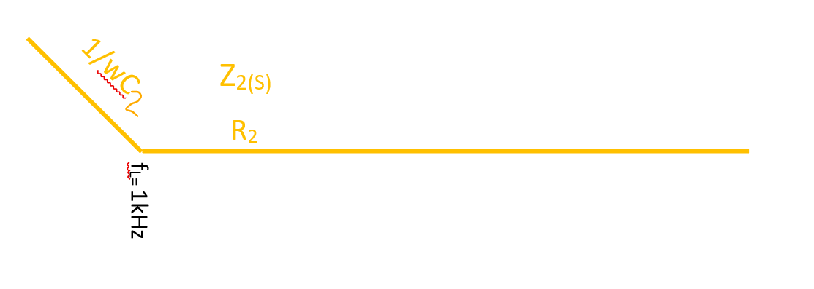

*Şekil 6.5 - $R_2$ sabit empedansı ve $Z_{C2}$ eğimi.*

$R_2$ direnci tüm frekanslarda sabittir. $Z_{C2}$ empedansı ise $-20\,\text{dB/dec}$ eğimle azalır. Kaynak belgede $R_2$ ve $Z_{C2}$ değerlerinin:

$$
f_L = 1\,\text{kHz}
$$

frekansında aynı empedansa sahip olması seçilmiştir.

Bu koşul:

$$
R_2 = \frac{1}{2\pi f_L C_2}
$$

ve:

$$
C_2 R_2 = \frac{1}{2\pi f_L}
$$

verir.

$f_L=1\,\text{kHz}$ için:

$$
C_2 R_2
=
\frac{1}{2\pi\cdot 1\,\text{kHz}}
=
159.1549\,\mu
$$

olur.

> Not: Kaynak DOCX'in ilerleyen denklem listesinde bu değer bir yerde `152.1549u` gibi görünmektedir. $f_L=1\,\text{kHz}$ ve nihai $R_2=100\,\text{k}\Omega$, $C_2=1.59\,\text{nF}$ seçimiyle tutarlı değer $159.1549\,\mu$ değeridir.

### 6.2.2. $+20\,\text{dB/dec}$ Eğimin Gerçeklenmesi

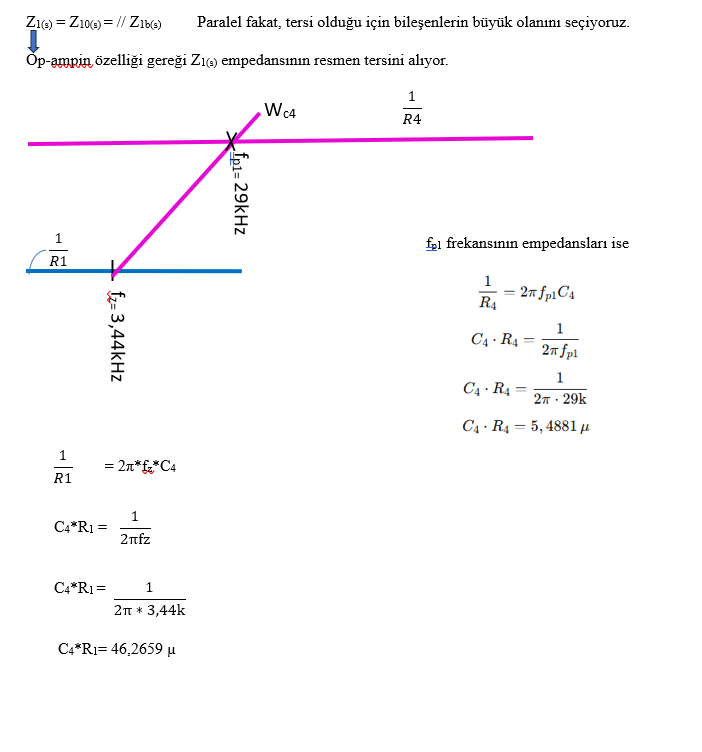

*Şekil 6.6 - Bobin davranışına benzer $+20\,\text{dB/dec}$ eğimin sığaç empedansının terslenmesiyle elde edilmesi.*

Bobin davranışını andıran $+20\,\text{dB/dec}$ eğim, sığaç empedansının terslenmesiyle sağlanır.

### 6.2.3. $Z_1(s)$ ve $Z_2(s)$ Dominant Bileşenleri

$Z_1(s)$ ve $Z_2(s)$ seri bağlı alt elemanlardan oluşur. Bu yüzden belirli frekans aralıklarında bileşenlerden büyük olan empedans eşdeğer davranışı belirler.

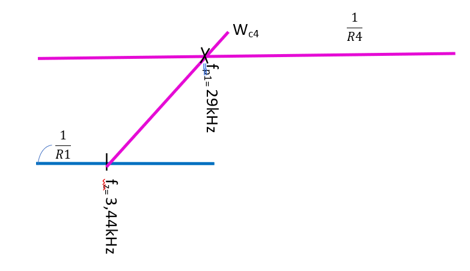

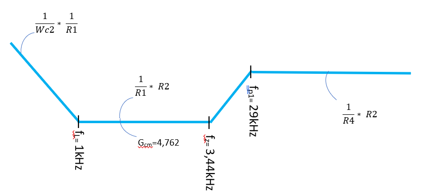

*Şekil 6.7 - $Z_1(s)$ ve $Z_2(s)$ için frekans bölgesine göre dominant empedanslar.*

### 6.2.4. Eleman Değerlerinin Çözülmesi

Bulunan denklemler:

$$
\frac{R_2}{R_4} = 40.144
$$

Kaynak belgede ayrıca pratik direnç aralığıyla ilgili bir eşitsizlik notu vardır; bu not sonucunda kiloohm mertebesine çıkması gereken dirençler çok küçük çıktığı için pratik çözümde dikkate alınmamıştır.

Zaman sabiti denklemleri:

$$
C_2 R_2 = 159.1549\,\mu
$$

$$
C_4 R_4 = 5.4881\,\mu
$$

$$
C_4 R_1 = 46.2659\,\mu
$$

Kazanç oranı:

$$
\frac{R_2}{R_1} = 4.762
$$

Toplamda 4 denklem ve 5 bilinmeyen vardır:

$$
R_1,\ R_2,\ R_4,\ C_2,\ C_4
$$

Bu nedenle bilinmeyenlerden birine değer verilerek çözüm yapılır. Matematiksel olarak sonsuz sayıda çözüm mümkün olsa da değerler devredeki fiziksel karşılıkları düşünülerek seçilir.

Kaynak belgede:

$$
R_2 = A
$$

alınır.

Buna göre:

$$
R_1 = \frac{A}{4.762}
$$

$$
R_4 = 0.0249A
$$

$$
C_2 = \frac{159.1549\times 10^{-6}}{A}
$$

$$
C_4 = \frac{220\times 10^{-6}}{A}
$$

elde edilir.

Eğer:

$$
A = 100\,\text{k}\Omega
$$

seçilirse:

| Eleman | Değer |
|---|---:|
| $R_2$ | $100\,\text{k}\Omega$ |
| $R_1$ | $21\,\text{k}\Omega$ |
| $R_4$ | $2.4\,\text{k}\Omega$ |
| $C_2$ | $1.59\,\text{nF}$ |
| $C_4$ | $2.2\,\text{nF}$ |

elde edilir.

Bu değerler, Bölüm 5'te hedeflenen $G_c(s)$ compensator davranışını op-amp devresi üzerinde gerçekleştirmek için kullanılan pratik eleman değerleridir.

# 7. Benzetim Sonuçları

Bu bölümde amaç, tasarım gereksinimlerini karşılayabilen bir devre tasarlandığını göstermek ve önceki bölümlerde kağıt-kalem ile yapılan hesapların LTspice benzetimleriyle doğrulanmasını sağlamaktır. Bu nedenle bulunan değerler olduğu gibi LTspice devresinde kullanılmış, sonuçlar görsellerle birlikte raporlanmıştır.

## 7.1. Tasarım Gereksinimleri

| Gereksinim | Hedef | Raporlanan benzetim sonucu | Değerlendirme | Kanıt |
|---|---:|---:|---|---|
| Input voltage range | $24-36\,\text{V}$ | $24\,\text{V}$ ve $36\,\text{V}$ çalışma noktaları kullanıldı | Geçti | [Bölüm 7.2](#benzetimde-kullanilan-elemanlar-ve-parametreler) |
| Input voltage transient limit | $44\,\text{V}$, en çok $1\,\text{ms}$ | Gereksinim olarak listelenmiş; bu raporda ayrı transient dayanım dalga şekli yok | Takip gerekiyor | Not |
| Output power range | $50-125\,\text{W}$ | Yaklaşık $49.6-124.2\,\text{W}$ | Geçti | [Şekil 7.1](#fig-output-power-50w), [Şekil 7.2](#fig-output-power-125w) |
| Output voltage static requirement | $14\,\text{V}\pm3\%$ | Raporlanan sapma yaklaşık $\%1.30$ | Geçti | [Şekil 7.3](#fig-static-output) |
| Output voltage transient limits | $14\,\text{V}\pm20\%$ | Raporlanan transient sapma yaklaşık $\pm\%8.58$ | Geçti | [Şekil 7.4](#fig-transient-output) |
| Allowed output voltage ripple | $100\,\text{mV}_{p-p}$ | Yaklaşık $37.38\,\text{mV}_{p-p}$ | Geçti | [Şekil 7.5](#fig-output-ripple) |
| Allowed input current ripple | $50\,\text{mA}_{p-p}$, ideal source | Bu raporda ayrı görsel kanıtla kapatılmamış | Takip gerekiyor | Not |
| Minimum efficiency | $\%90$ | Yaklaşık $\%97.78$ ve diğer çalışma noktalarında $\%97.99$, $\%98.63$, $\%98.14$ | Geçti | [Şekil 7.6](#fig-eff-36v), [Şekil 7.7](#fig-eff-24v) |
| Ambient temperature range | $-20^\circ\text{C}$ to $+50^\circ\text{C}$ | Gereksinim olarak listelenmiş; sıcaklık sweep'i bu raporda yok | Takip gerekiyor | Not |

Notlar:

1. Converter, $44\,\text{V}$ input voltage transient durumunda hayatta kalabilmelidir; bu transient sırasında çalışması zorunlu değildir.
2. Output voltage, minimum ve maksimum yük arasındaki adımlarda belirtilen sınırların dışına çıkmamalıdır.

## 7.2. Benzetimde Kullanılan Elemanlar ve Parametreler

| Parametre / eleman | Değer |
|---|---:|
| Giriş gerilimi, $V_{s,max}$ | $36\,\text{V}$ |
| Giriş gerilimi, $V_{s,min}$ | $24\,\text{V}$ |
| Maksimum çıkış gücü, $P_{max}$ | $125\,\text{W}$ |
| Minimum çıkış gücü | $50\,\text{W}$ |
| Çıkış gerilimi, $V_o$ | $14\,\text{V}$ |
| Hesaplanan çıkış ripple hedefi | $\Delta V_o \approx 27\,\text{mV}$ |
| Çıkış sığacı | $C=82\,\mu\text{F}$ |
| Sığaç ESR | $R_{ESR}=19.39\,\text{m}\Omega$ |
| MOSFET | BSC150N03LD |
| MOSFET on direnci | $R_{on}=15\,\text{m}\Omega$ |
| Bobin seri direnci | $R_L=15\,\text{m}\Omega$ |
| Minimum yük direnci | $R_{load,min}=1.569\,\Omega$ |
| Maksimum yük direnci | $R_{load,max}=3.921\,\Omega$ |
| Minimum duty cycle | $D_{min}=0.3888$ |
| Maksimum duty cycle | $D_{max}=0.5833$ |
| Op-amp | LT1215, $23\,\text{MHz}$ |
| Compensator elemanları | $R_2=100\,\text{k}\Omega$, $R_1=21\,\text{k}\Omega$, $R_4=2.4\,\text{k}\Omega$, $C_2=1.59\,\text{nF}$, $C_4=2.2\,\text{nF}$ |
| Sensor gain elemanları | $R_3=12.8\,\text{k}\Omega$, $R_5=87.2\,\text{k}\Omega$ |
| Gate dirençleri | $R_{g1}=5\,\Omega$, $R_{g2}=5\,\Omega$ |
| Schottky diyot | 1N5817, $1\,\text{A}$, $20\,\text{V}$ |
| PWM ramp genliği | $V_m=4\,\text{V}$ |
| Anahtarlama frekansı | $f_s=100\,\text{kHz}$ |
| Referans gerilimi | $V_{ref}=1.8\,\text{V}$ |

## 7.3. Çıkış Gücü

İstenen güç aralığı:

$$
50\,\text{W} \le P_{out} \le 125\,\text{W}
$$

Benzetimde raporlanan güç aralığı:

$$
P_{out} \approx 49.5957\,\text{W} - 124.1839\,\text{W}
$$

Bu değerler hedeflenen $50-125\,\text{W}$ aralığının çok yakınında ve pratik tolerans içinde kabul edilmiştir.

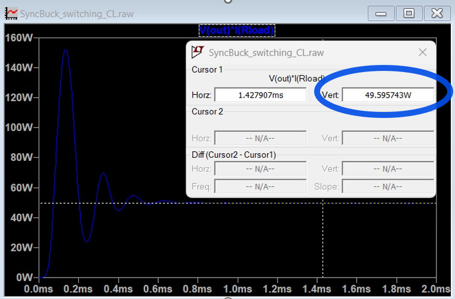

*Şekil 7.1 - Düşük güç çalışma noktasında $P_{out}\approx49.5957\,\text{W}$ ölçümü.*

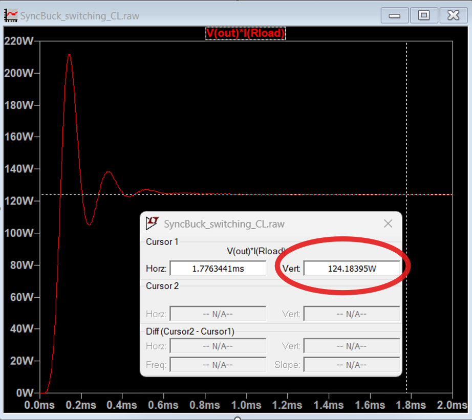

*Şekil 7.2 - Yüksek güç çalışma noktasında $P_{out}\approx124.1839\,\text{W}$ ölçümü.*

## 7.4. Output Voltage Static Requirement

İstenen statik çıkış gerilimi:

$$
V_o = 14\,\text{V}\pm3\%
$$

Raporlanan sonuçta statik çıkış geriliminde yaklaşık $\%1.30$ sapma olduğu belirtilmiştir. Görseldeki cursor değeri:

$$
V_{out}\approx13.981693\,\text{V}
$$

olarak okunmaktadır. Her iki durumda da değer $14\,\text{V}\pm3\%$ statik gereksiniminin içindedir.

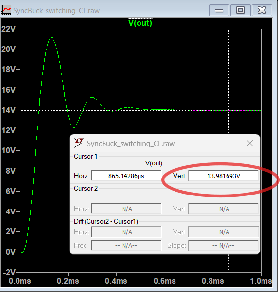

*Şekil 7.3 - Statik çıkış gerilimi ölçümü; kaynak raporda yaklaşık $\%1.30$ sapma not edilmiştir.*

## 7.5. Output Voltage Transient Limits

İstenen transient sınırı:

$$
V_o = 14\,\text{V}\pm20\%
$$

Benzetimde yük akımı yaklaşık $1\,\mu\text{s}$ içinde:

$$
I_{max}=8.92\,\text{A}
\quad \rightarrow \quad
I_{min}=3.57\,\text{A}
$$

arasında değişmektedir. Kaynak raporda çıkış gerilimindeki transient sapma yaklaşık:

$$
\pm 8.58\%
$$

olarak verilmiştir. Bu değer $20\%$ transient sınırının içindedir.

Grafikte çıkış geriliminin düşük akım/yük geçişinde yaklaşık $12.70\,\text{V}$ seviyesine indiği ve üst yönde yaklaşık $15.17\,\text{V}$ seviyesine çıktığı görülür. Yaklaşık $0.3\,\text{ms}$ içinde toparlanma not edilmiştir.

*Şekil 7.4 - Minimum ve maksimum yük akımı arasında transient çıkış gerilimi davranışı.*

## 7.6. Allowed Output Voltage Ripple

İstenen çıkış ripple sınırı:

$$
\Delta V_{o,p-p} \le 100\,\text{mV}
$$

Kararlı halde raporlanan tepeden tepeye çıkış gerilimi dalgalanması:

$$
\Delta V_o \approx 37.38\,\text{mV}
$$

olarak ölçülmüştür. Bu değer $100\,\text{mV}_{p-p}$ sınırının belirgin biçimde altındadır.

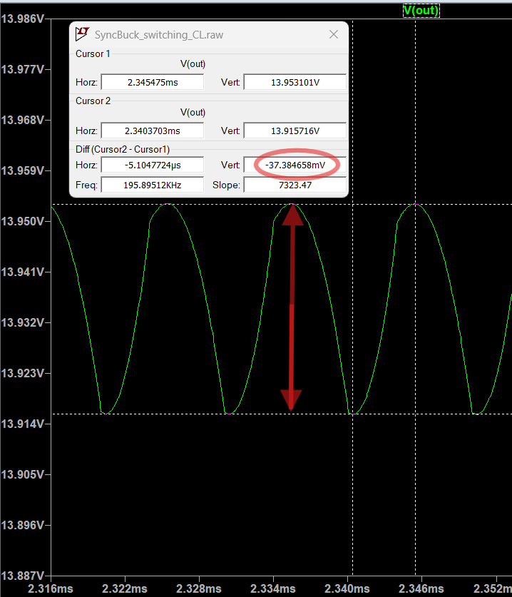

*Şekil 7.5 - Kararlı halde $V_{out}$ ripple ölçümü: yaklaşık $37.38\,\text{mV}_{p-p}$.*

## 7.7. Verimlilik

İstenen minimum verimlilik:

$$
\eta \ge 90\%
$$

Kaynak raporda $V_g=36\,\text{V}$ ve $R=1.569\,\Omega$ için:

$$
\eta
=
\frac{P_{out}}{P_{in}}
=
\frac{123.8\,\text{W}}{126.6\,\text{W}}
=
0.9778
$$

olarak verilmiştir. Bu:

$$
\eta \approx 97.78\%
$$

demektir.

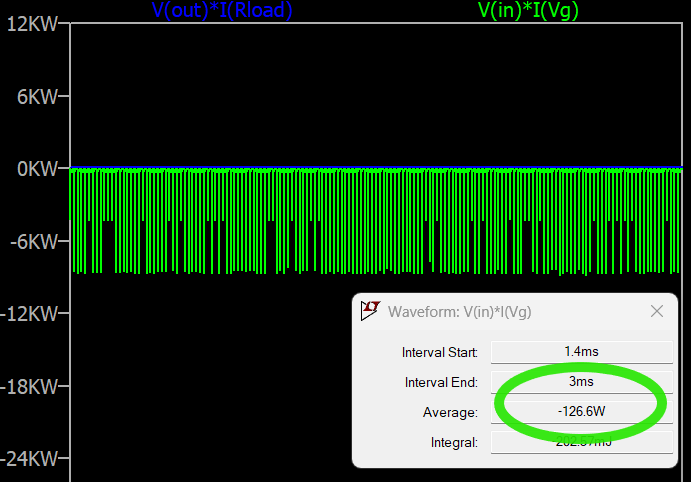

*Şekil 7.6 - $V_g=36\,\text{V}$ ve $R=1.569\,\Omega$ için giriş gücü ölçümü; ortalama $P_{in}\approx126.6\,\text{W}$.*

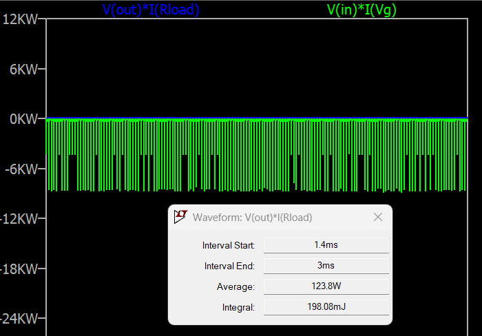

*Şekil 7.7 - $V_g=36\,\text{V}$ ve $R=1.569\,\Omega$ için çıkış gücü ölçümü; ortalama $P_{out}\approx123.8\,\text{W}$.*

Diğer çalışma noktaları:

| Çalışma noktası | Raporlanan güç oranı | Verim |
|---|---:|---:|
| $V_g=24\,\text{V}$, $R=1.569\,\Omega$ | $124.01\,\text{W}/126.55\,\text{W}$ | $97.99\%$ |
| $V_g=24\,\text{V}$, $R=3.921\,\Omega$ | $49.599\,\text{W}/50.29\,\text{W}$ | $98.63\%$ |
| $V_g=36\,\text{V}$, $R=3.921\,\Omega$ | $49.542\,\text{W}/50.482\,\text{W}$ | $98.14\%$ |

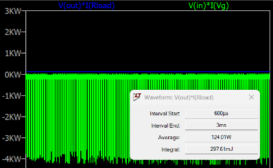

*Şekil 7.8 - $V_g=24\,\text{V}$, $R=1.569\,\Omega$ için $P_{out}\approx124.01\,\text{W}$.*

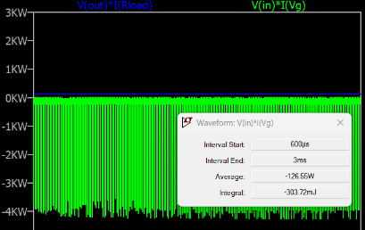

*Şekil 7.9 - $V_g=24\,\text{V}$, $R=1.569\,\Omega$ için $P_{in}\approx126.55\,\text{W}$.*

## 7.8. Hesaplamaların Doğrulanması

Bu bölümün iki temel amacı vardır:

- Belirlenen tasarım specifications'larını karşılayabilen bir devre tasarlandığını göstermek.
- Önceki bölümlerde kağıt-kalemle yapılan hesaplamaların doğrulamasını yapmak.
- Bu yüzden bulunan değerler olduğu gibi değiştirilmeden LTspice'da kullanılmıştır.
- Bu değerlerin benzetim sonuçları gösterilmiştir.
- İyileştirmeler yapmak mümkündür; bu ilk çalışma, hesaplanan değerlerin hedefleri karşıladığını gösteren temel doğrulama niteliğindedir.

Doğrulama sonuçları özetle:

| Doğrulama alanı | Sonuç |
|---|---|
| Güç aralığı | Yaklaşık $49.6-124.2\,\text{W}$ |
| Statik çıkış gerilimi | Hedef $14\,\text{V}\pm3\%$ içinde |
| Transient çıkış sapması | Yaklaşık $\pm8.58\%$, hedef $\pm20\%$ içinde |
| Çıkış ripple | Yaklaşık $37.38\,\text{mV}_{p-p}$, hedef $100\,\text{mV}_{p-p}$ altında |
| Verim | Yaklaşık $97.78\%$ ana raporlanan çalışma noktası; tüm raporlanan noktalar $\%90$ üzerinde |

# 8. Projenin Geleceği

Projenin devamında yapılacaklar:

- LM5146 kontrolcüsü kullanılacak.
- Giriş filtresi tasarlanacak.
- Eleman seçimleri kesinleştirilecek.
- MOSFET sürücüsü ile ilgili hesaplar yapılacak.
- Ortalama model kullanılarak frekans alanında inceleme yapılacak.
- Verimlilikler ve kayıplar hesaplanacak.
- Parametrik değerler verilerek iyileştirmeler yapılacak.
- Bobinle ilgili hesaplar detaylandırılacak.
- Altium'da çizim yapılacak.

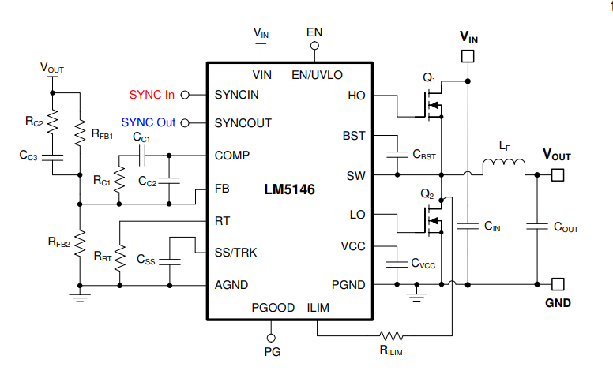

*Şekil 8.1 - LM5146 tabanlı sonraki tasarım yönü için tipik uygulama şeması.*

# Kaynaklar

[1] R. W. Erickson and D. Maksimovic, *Fundamentals of Power Electronics*, 3rd ed., Cham: Springer, 2020.

[2] P. Parto, P. Asadi, and A. M. Rahimi, "Compensator design procedure for buck converter with voltage-mode error-amplifier," Application Note AN-1162, International Rectifier, 2006.

[3] Wikipedia contributors, "Root mean square," Wikipedia. Available: <https://en.wikipedia.org/wiki/Root_mean_square>.

[4] D. Can, "DC-DC Buck Converter Design Part 1 - Open-Loop Design - Calculations & MATLAB & TINA-TI SPICE," YouTube. Available: <https://youtu.be/fE1lxyE7ILI?si=ux-xqTelJLZC5YQm>.

[5] E. Rogers, "Understanding Buck Power Stages in Switchmode Power Supplies," Texas Instruments Application Report, SLVA044, March 1999.

[6] B. Hauke, "Basic Calculation of a Buck Converter's Power Stage," Texas Instruments Application Report, SLVA477B, December 2011, revised August 2015.

[7] T. Taufik, "Practical Design of Buck Converter," California Polytechnic State University.

## Repo İçindeki Reference / Source Material Notu

Repo içinde `G5_mit6_622_s23_designproj.pdf`, `G32_lm5146-q1.pdf` ve power electronics kaynak kitabı PDF/TXT dosyaları source/reference material olarak durmaktadır. Üçüncü taraf PDF'lerin lisans ve dağıtım durumu bu çalışma içinde ayrıca doğrulanmadı; bu nedenle teknik dokümantasyonda nötr biçimde referans materyali olarak konumlandırılmıştır.

# Ekler

## EK-1. Sığaç Verisayfası

Kaynak raporda seçilen çıkış sığacı için veri sayfası kesiti verilmiştir. $82\,\mu\text{F}$ sınıfındaki sığaç ve ESR/ripple bilgileri güç katı hesabında kullanılan $C$ ve $R_{ESR}$ seçimlerini destekler.

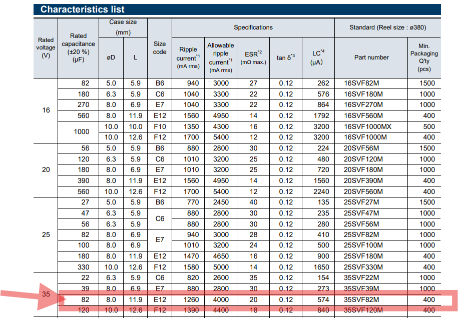

*Şekil E.1 - Sığaç veri sayfası kesiti; $82\,\mu\text{F}$ satırı kaynak raporda işaretlenmiştir.*

## EK-2. Genel Görünüm

Kaynak raporda LTspice devresinin genel görünümü de ek olarak verilmiştir. Bu devre görünümünde güç katı, bootstrap/driver yapısı, PWM, LT1215 op-amp compensator, feedback dirençleri ve yük yapısı birlikte görülür.

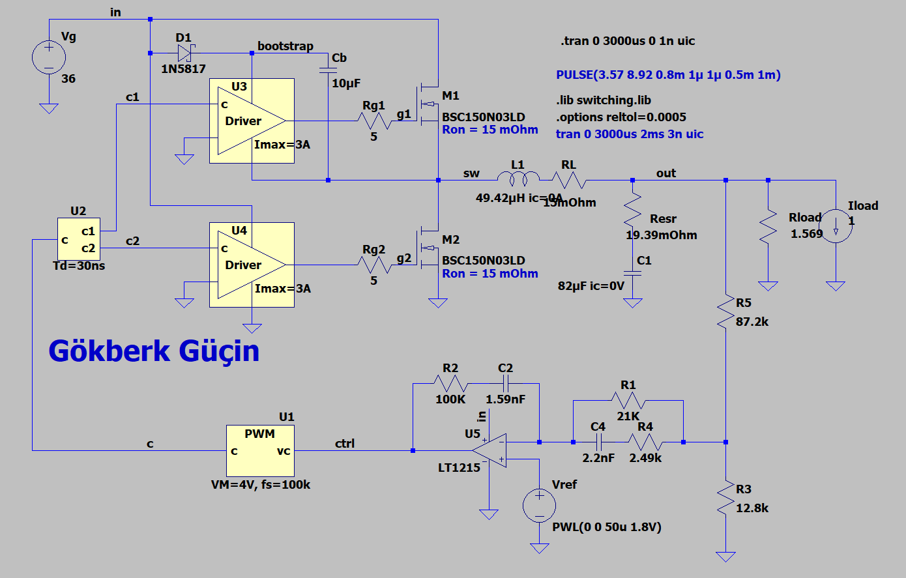

*Şekil E.2 - Senkron buck converter LTspice devresinin genel görünümü.*
